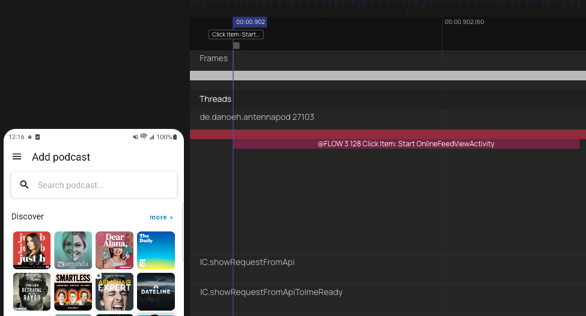

# Manual Annotation for User Flows

In addition to automatically instrumenting your app, the Product Science SDK provides a `userflow` library that enables manual annotation of user flows in your code. 
This can be useful for tracking and comparing timing changes between specific events across traces.

The steps to add and use the library are below.

## Dependencies
 Add the userflow library as a dependency in `app/build.gradle`

```groovy
    dependencies {
        implementation "com.productscience.userflow:userflow:0.15.1"
    }
```

## Annotation Process

There are three static methods used to annotate user flows:

* `UserFlow#start`
* `UserFlow#custom`
* `UserFlow#end`

Each of these methods take an integer argument (UserFlow ID) and a nullable String argument (comment).

### 1. Starting a UserFlow
To start a UserFlow, call `UserFlow#start` and pass it an ID and a String message.
```kotlin
    UserFlow.start(1, "App start begins")
```

### 2. Annotations UserFlow's milestones
While a UserFlow is in progress, you can make calls to `UserFlow#custom` passing the UserFlow ID and a String message. 
This can be useful to annotate events along the UserFlow (e.g., reaching a milestone or annotating different conditional paths among others).
```kotlin
    UserFlow.custom(1, "UserFlow hit milestone")
```    

### 3. Ending a UserFlow
To end a UserFlow, call `UserFlow#end` passing the ID of the UserFlow to end and a String message.
```kotlin
    UserFlow.end(1, "App start complete")
```
    
## Examples
### UserFlow Annotations on PSTool


### Sample app
There is a sample app demonstrating the use of the userflow library at:
[https://github.com/product-science/demoapps-private/tree/main/Android/userflow-android-example](https://github.com/product-science/demoapps-private/tree/main/Android/userflow-android-example)


## Project Integration
By default, UserFlow Annotations are added to traces only when Product Science plugin is applied.
To annotate user flows without applying the plugin, call `UserFlow#setAlwaysAnnotate(true)`.   

_CAUTION_: using this method can enable unwanted annotations in production builds.
You will have to take steps to ensure that UserFlow annotations are only called where appropriate.