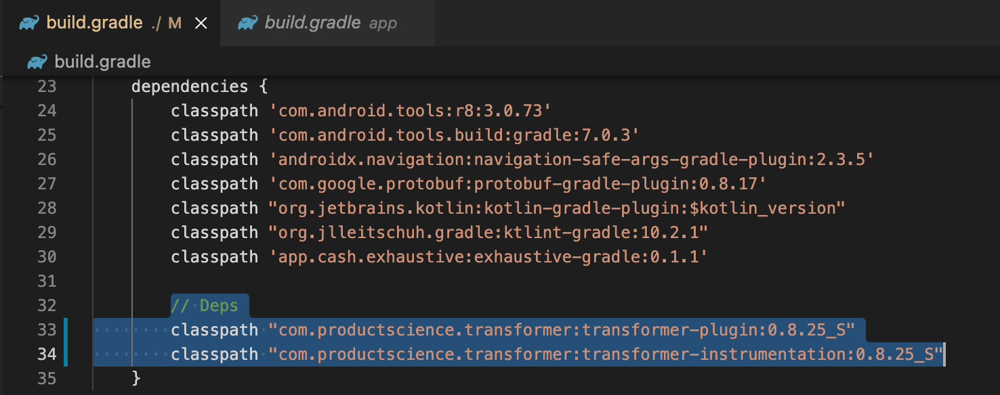

# Gradle Instructions - Android

## Preparation
1. Set up Gradle build with the Product Science plugin from the Product Science Github repo (see instructions below.)
2. Determine a named developer resource for Product Science to partner with for generating new builds
3. Ideally create a trigger for Product Science to generate new builds to increase speed of the Optimization process

## Optimization Loop
The Loop is repeated by your developers 20+ times initially and 5+ times with every major update.

1. **[Your devs]** Build the app with PSi Gradle plugin
    - Ideally Product Science is provided with a trigger to create automation- otherwise a named developer can be supplied to rebuild
2. **[Your devs]**  Provide a cloud link to your .apk
3. **[Product Science]** Runs the app and collects app performance data
    - Optimization may finish and we proceed to Insight Generation
4. **[Product Science]** Feeds the app performance data to Product Science optimization algorithms
5. **[Product Science]** Algorithms update model in the Product Science Github repo
6. **[Your devs]** Next build will use the new model from the Product Science Github repo automatically

## Gradle Instructions

### 1. Key Generation Methodology- PSi:  
* Generates a token (key) via GitHub
* Saves key in Bitwarden credential storage
* Shares token with Bitwarden Send 
* Keys have an expiration date

### 2. Configure `gradle.properties`  

 Set up `gradle.properties` in Gradle home directory:  
```bash
github_user=<supplied-by-PSi>
github_key=<supplied-by-PSi>
```

For example:  
  

### 3. Add Maven Built Info

In `build.gradle` add the maven build info to the repositories for project and subprojects:  

```bash
maven {
    url "https://maven.pkg.github.com/product-science/PSAndroid"
    credentials {
        username = github_user
        password = github_key
    }
}
```  

For example:  
  
and   
  

### 4. Add the PSi Classpath to Dependencies

Note that we are using a demo app for this example called “Signal” to visualize the process

```bash
classpath "com.productscience.transformer:transformer-plugin:0.8.25_S"
classpath "com.productscience.transformer:transformer-instrumentation:0.8.25_S"
```

For example:  
  

### 5. Enable PSi Profiling  

Add `<profileable android:shell="true" />` into `AndroidManifest.xml` to enable profiling

For example:  
  

### 6. Apply the PSi transformer.plugin  

Apply plugin: `"com.productscience.transformer.plugin" to app/build.gradle`

For example:  
  

### 7. Setup PSi Properties  

Create a file called `productscience.properties` and add the PSi config/token to it

```bash
productscience.github.config=product-science:CLIENTNAME-configs:ps-CLIENTNAME.yaml:master
productscience.github.token=<supplied-by-PSI>
```

### 8. Build Your App
Now you can build your app with Gradle

For example:  
  

### Separate build configuration

For the future work convenience it’s best to create a separate build configuration with PSi.
A special flag enableProductScience can be used for these purposes:
   
  
  

Then you can build your app with PSi using the flag:  

