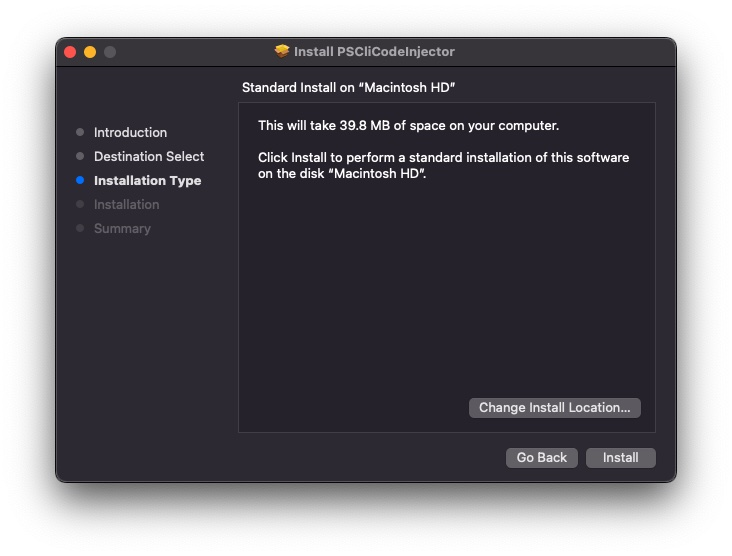

# iOS Build Instructions - Xcode

The following instructions describe how to add Product Science instrumentation to an iOS application that is built using Xcode. Bazel-specific instructions can be found [here](bazel.md).

## 1. Copy `productscience.yaml` to your project's root directory

_NOTE: Skip this step if your build environment does not allow network access. PS will share detailed instructions directly with your team._

Product Science will provide you with a `productscience.yaml` file that contains your credentials and configuration details.

!!! info

    If you haven't received this file or need to request a new copy, please reach out to your designated integration support contact via established communication channel. If this contact is unavailable, send an email to support@productscience.ai for assistance.

Once you've received your `productscience.yaml` file, copy the file to your project's root directory (next to your `.xcodeproj` or `.xcworkspace`).

## 2. Install `PSCliCodeInjector`

_NOTE: Offline builds are not hosted on our public repo. If your build environment does not allow network access, PS will work with your team to share offline-compatible builds via a private channel._

Download the latest installer package (named `PSCliCodeInjector.pkg`) from our [public plugin repo](https://github.com/product-science/PSios/releases).

Double-click the downloaded `.pkg` to start the installation process. By default, `PSCliCodeInjector` will be installed to `/usr/local/bin`.



## 3. Run `PSCliCodeInjector`

`PSCliCodeInjector` adds Product Science's instrumentation to your project's source code.

Before any changes are made to your project, `PSCliCodeInjector` will create a copy of your project's directory and save it to a backup location. `PSCliCodeInjector` will then add Product Science's instrumentation to your application's source code. The backup directory will contain the original, un-instrumented code.

!!! warning "Important"
    When you want to create an instrumented build, be sure to use the original project directory and not the backup directory.

!!! warning "Important"
    The code changes made by `PSCliCodeInjector` result in a large number of compile-time warnings. If your project's `SWIFT_TREAT_WARNINGS_AS_ERRORS` setting is enabled, please disable before running code injection.

### Basic use

```shell
PSCliCodeInjector <root-directory> \
  --console-build-command "<console-build-command>"
```

There are only two required parameters when running `PSCliCodeInjector`:

1. `root-directory`: This is the path to your project's root directory. There must be either an `.xcodeproj` or an `.xcworkspace` at the top level of this directory. This is the same directory that you added your `productscience.yaml` file to.
2. `console-build-command`: This is the `xcodebuild` command that the tool will use to confirm that your project compiles successfully before and after injection. This command will be run from your project's root directory.

!!! warning "Important"
    PSCliCodeInjector parses `console-build-command`’s output to identify issues with the injected code. Be sure not to pipe the build’s results through tools like `xcbeautify`, `xcpretty`, etc. or this logic might not work correctly.

### Changing the backup directory

```shell
PSCliCodeInjector <root-directory> \
  --console-build-command "<console-build-command>" \
  --backup-dir <backup-directory>
```

A backup of your project's root directory will be created before injection is run. By default, this backup directory is created at  `<root-directory>-BACKUP`.

You can override the location of the backup directory by including the `--backup-dir` option with a custom directory path.

### Other options

`PSCliCodeInjector` accepts several other options. Pass the `--help` flag to see the full list:

```shell
PSCliCodeInjector --help
```

## 4. Distribute Build

Please follow instructions at [iOS Distribution Instructions](distribution.md) to share your build with us.

## Example: Firefox for iOS

### 1. Clone Firefox iOS repo

```bash
git clone https://github.com/mozilla-mobile/firefox-ios
```

### 2. Copy `productscience.yaml` and install `PSCliCodeInjector`

Copy your `productscience.yaml` file to the `firefox-ios` directory as described in Step 1 above.

Install `PSCliCodeInjector` as described in Step 2 above.

*If you use a standalone offline build, put `productscience.zip` archive in the project directory.*

### 3. Build with `PSCliCodeInjector`

The following example assumes that you are running the command from the cloned `firefox-ios` directory's parent directory, not from inside the `firefox-ios` directory.

```bash
PSCliCodeInjector firefox-ios \
    --backup-dir firefox-ios-BACKUP \
    --console-build-command=\
      "xcodebuild \
          -project Client.xcodeproj \
          -scheme Fennec \
          -destination 'name=iPhone 13 mini' \
          -sdk iphoneos"
```

Note this example uses `iPhone 13 mini` as the example destination- this can be changed.

When complete, the `firefox-ios` directory will have been transformed. `firefox-ios-BACKUP` is a directory with original project.
```bash
drwxr-xr-x  76 user  staff      2432 Jul 12 16:26 firefox-ios
drwxr-xr-x  77 user  staff      2464 Jul 12 16:46 firefox-ios-BACKUP
```

Use `firefox-ios` for your pipeline or Xcode.
