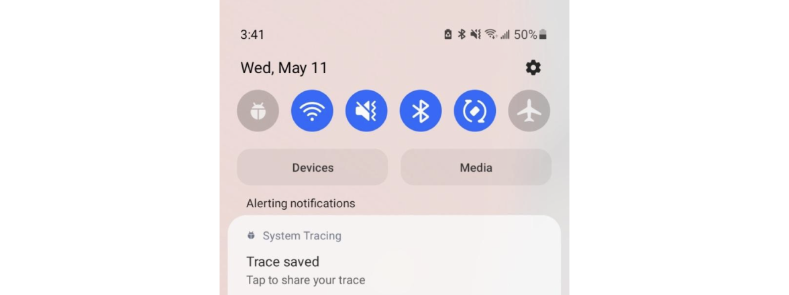

Android
---------

## Record

### 1. Install instrumented app

Install the app that you want to analyze instrumented with PS plugin. Don't have the app? Learn [here](../android/gradle.md) how to build instrumented app.

### 2. Select a user flow you want to analyze

At Product Science, performance optimization starts with defining key user flows that bring the most value to users.

##### What is a user flow?

There are several ways to select a user flow:

- (**preferred**) __An "Action-Reaction" one step flow__. Here the user starts with an Action (pressing a button, swiping, selecting a menu item, etc) and you measure until a "Reaction", such as a new page being fully displayed. These flows are clean and simple to analyze.
- __More complex flows__. Sometimes, there are multiple steps that need to be strung together to get an idea of the performance of a feature. It can make sense to have flows like these, but consider carefully if they cannot be broken into smaller parts.

Either way, a sequence of functions execute before the user finally arrives at a final state. This is where our AI technology comes into play—highlighting these sequences that formed into what we call __execution paths__.

**Flows should be short, in the order of 30 seconds, to enable the analysis to be a manageable size.**

### 3. Get to the beginning of your user flow
Before you start recording:
1. Optional Step: [quit all open apps](https://support.google.com/android/answer/9079646?hl=en-IN#zippy=%2Cclose-apps) so nothing slows down the app you are measuring.
2. Navigate to the beginning of your user flow. If recording a trace for app start, just navigate to the icon for your app on the Home screen.

### 4. Start screen and trace recording
Start both the screen and trace recording as described above.

The 'Record trace' button should be available in your quick settings tile. If it is not, go back to the section on [enabling trace recording](device-set-up.md#3-make-sure-tracing-is-enabled) and ensure you enabled __Show Quick Settings tile__.

    

### 5. Execute your user flow.
Perform the user action to execute the identified user flow.

### 6. Stop recordings at the end of your flow
When you have reached the end of the user flow, swipe down from the top again to access the Quick Settings and tap both the "Record trace" and "Screen recorder" buttons to turn the recordings off.

## Upload

### 7. Upload your trace and video to PS Tool

- Open your notification panel &gt; “Tap to share you trace”
- Tap the notification. You will have the option to save it or export it to different apps.

- Select the Product Science app (PS)

-   Name the trace, assign it to the relevant flow
  
#### Attach screen recording
- On the same screen, while the trace details screen is still opened, tap "Select"

- Phone library opens &gt; select the screen recording

    

- Once trace and video finish uploading and processing, you can view your trace in PS Tool. Uploaded trace will appear in your productscience.app Flow Library.

